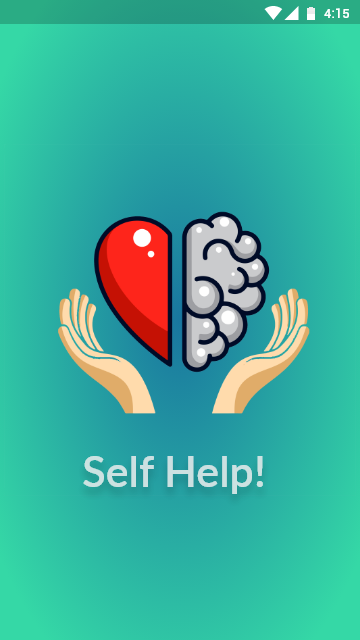
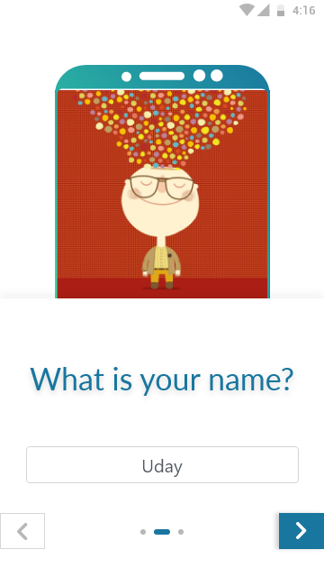
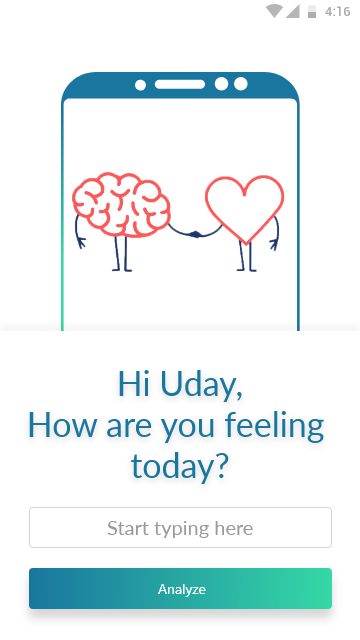
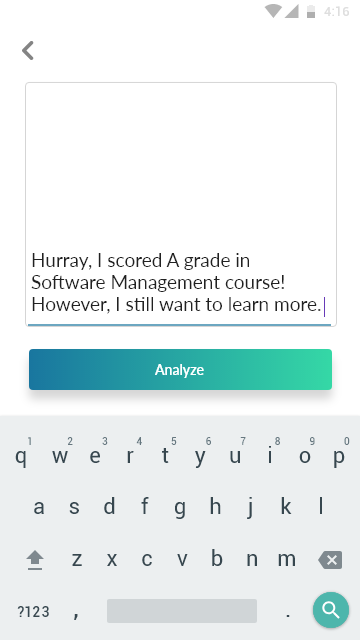
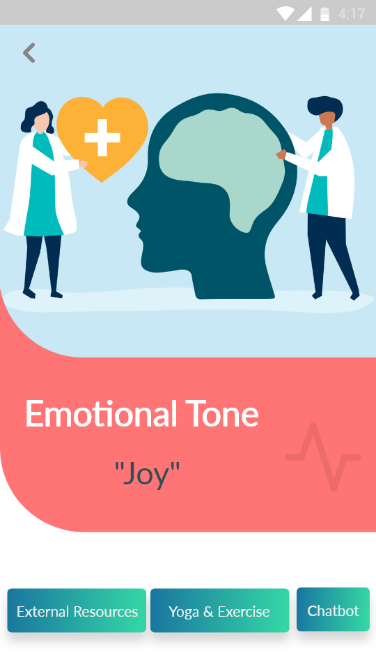
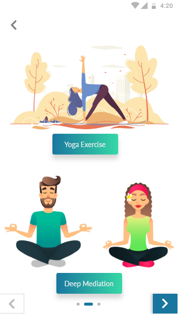

# Self-Help! - Know yourself and get helped.

In 21st century, mental disorder is rising rapidly. According to a survey of Anxiety and Depression Association of America (ADAA), “Anxiety disorders are highly treatable, yet only 36.9% of those suffering receive treatment” and also more than half which are diagnosed with anxiety are also suffering from depression. People who are suffering are afraid to talk to others about their mental disorder. Hence, to solve this problem we are building an android application “self-help!” which could fill this gap and help them to lead a healthy and peaceful life.

## Welcome 
     


```under development```

### Download android APK from following link
[self-help mobile application](./apk/selfhelp-alpha.apk)

### Please give feedback for our application.
[Feedback Link](https://docs.google.com/forms/d/e/1FAIpQLSdu3xHjCL1_3lXXW0bO-CkncguCXumnY50AFs-9ZdddlCPaWg/viewform)

### Support or Contact

Having trouble with installation? Check out our [documentation]() or [contact]() and we’ll help you sort it out.
